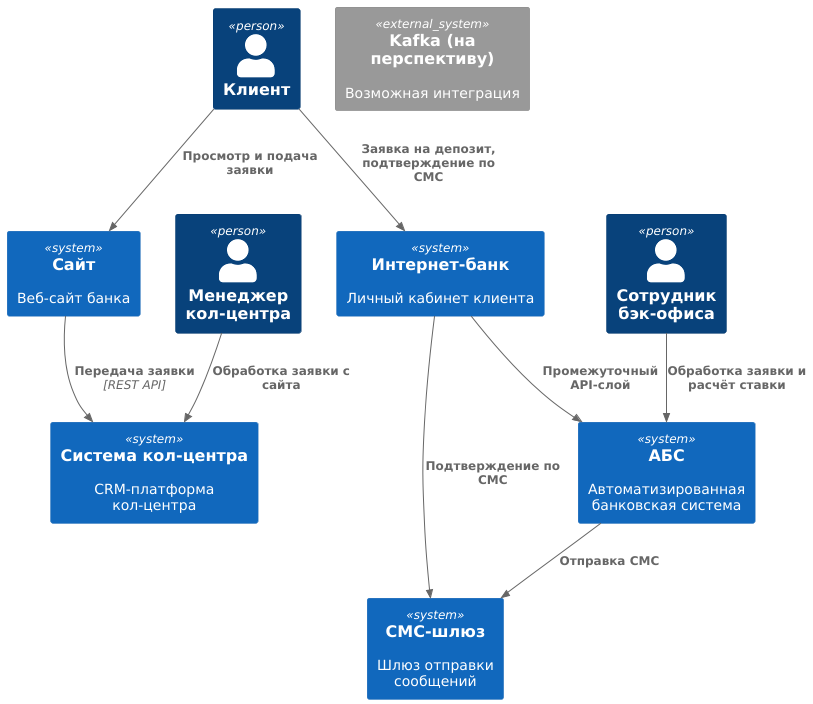
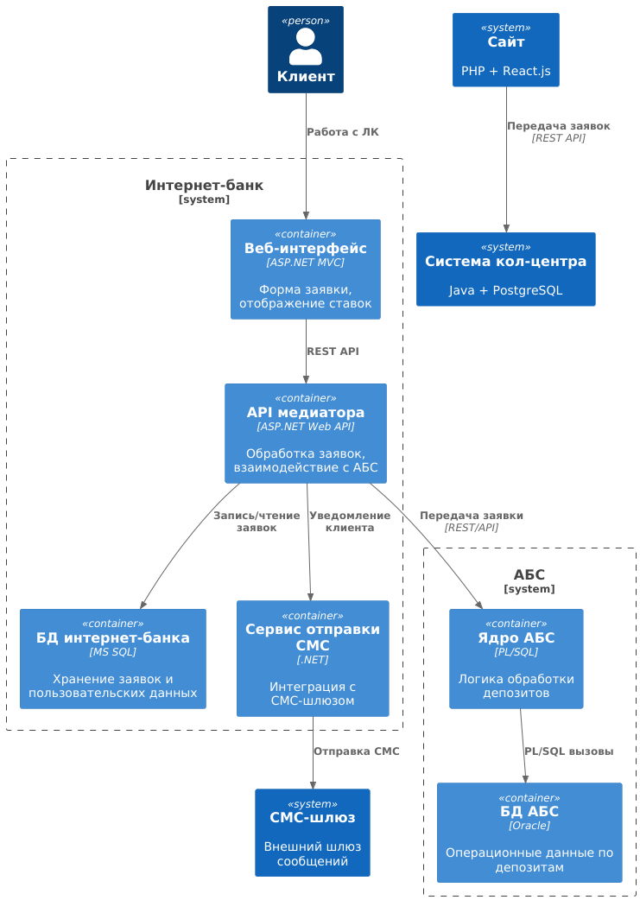

### **Название задачи:**
ADR-STD-MVP1 Открытие депозитов онлайн в MVP интернет-банка

### **Автор:**
Команда цифровой трансформации банка «Стандарт»

### **Дата:**
2025-03-28

### **Функциональные требования**

|**№**|**Действующие лица или системы**|**Use Case**|**Описание**|
| :-: | :- | :- | :- |
| 1 | Клиент, Сайт | Подача заявки на депозит | Клиент вводит ФИО и номер телефона, заявка передаётся в систему кол-центра |
| 2 | Менеджер, Система кол-центра | Обработка заявки с сайта | Менеджер звонит клиенту и может назначить индивидуальную ставку |
| 3 | Клиент, Интернет-банк | Открытие депозита в ЛК | Клиент выбирает депозит, указывает счёт и сумму, подтверждает СМС-кодом |
| 4 | Сотрудник бэк-офиса, АБС | Подтверждение условий депозита | Сотрудник обрабатывает заявку, назначает ставку в АБС |
| 5 | Система, СМС-шлюз | Оповещение клиента | Система отправляет СМС об одобрении и открытии депозита |

### **Нефункциональные требования**

|**№**|**Требование**|
| :-: | :- |
| 1 | Защита данных (SSL/TLS) на сайте и в интернет-банке |
| 2 | Доступность интернет-банка и сайта 99.9% |
| 3 | Время отклика операций < 1 секунды |
| 4 | Масштабирование интернет-банка горизонтально, АБС — вертикально |
| 5 | Минимизация зависимости от подрядчика (СМС и доработки) |
| 6 | Использование стека с внутренней экспертизой (Java, .NET, MS SQL, Oracle) |
| 7 | Внутренняя разработка документации |
| 8 | Поддержка микросервисной архитектуры в рамках модуля открытия депозитов |
| 9 | Возможность интеграции с Kafka в будущем |

### **Решение**

**Диаграммы:**

C4 уровень 1: взаимодействие клиентов и внешних систем с интернет-банком, сайтом, кол-центром, АБС.

C4 уровень 2: детализация интернет-банка (frontend/backend, модуль депозитов), взаимодействие с АБС, шиной обмена, шлюзом СМС.

**Ключевые решения:**
- Вводим модуль обработки депозитов в интернет-банке.
- Создаётся промежуточный API-сервис между интернет-банком и АБС (анти-зависимость от АБС).
- Для сайта создаётся REST-интерфейс приёма заявок, данные пишутся в БД и передаются в кол-центр.
- Все шифрование обеспечивается на уровне HTTPS, без доработок ядра.
- Уведомления идут через существующий СМС-шлюз, без участия подрядчика.
- Используются текущие базы: Oracle (АБС), MS SQL (интернет-банк).
- Возможен постепенный переход к микросервисам, начиная с модуля депозитов.

### **Альтернативы**
- Доработка ядра интернет-банка подрядчиком для отправки СМС (отклонено: высокая стоимость и зависимость)
- Прямая интеграция интернет-банка с АБС (отклонено: угроза отказоустойчивости)

**Недостатки, ограничения, риски**
- Нагрузка на АБС может вырасти, если не будет кеширования и промежуточного слоя
- Возможные задержки в подтверждении открытия, если бэк-офис будет перегружен
- Ограниченная масштабируемость из-за архитектуры АБС
- Возможны трудности при интеграции сайта с кол-центром, потребуется доработка

