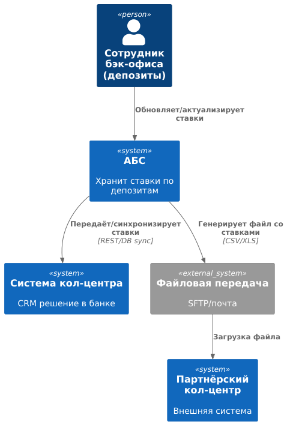
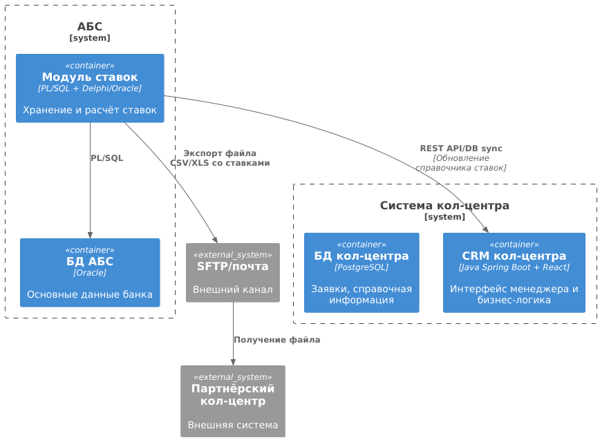
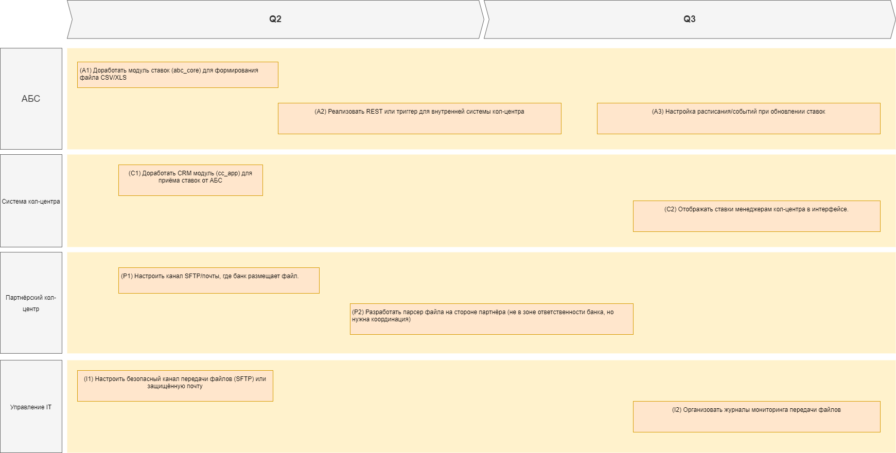

Ниже приведён пример ADR для нового кейса по передаче ставок кол-центрам (включая партнёрский). При необходимости
оформите его в отдельном Markdown-файле, а RoadMap — в отдельном draw.io.

---

## ADR: Передача ставок кол-центрам

### Название задачи

ADR-STD-MVP2 «Передача ставок в кол-центр и партнёрский кол-центр»

### Автор

Команда цифровой трансформации банка «Стандарт»

### Дата

2025-03-28

---

### Функциональные требования (Use Cases)

| № | Действующие лица или системы             | Use Case                                  | Описание                                                                                                                           |
|:-:|:-----------------------------------------|:------------------------------------------|:-----------------------------------------------------------------------------------------------------------------------------------|
| 1 | Сотрудник кол-центра, Система кол-центра | Получение списка текущих ставок           | Менеджер кол-центра видит в своей системе общий список депозитных ставок для консультаций клиентов                                 |
| 2 | Партнёрский кол-центр, Файл обмена       | Получение списка депозитных ставок файлом | Партнёрский кол-центр регулярно получает файл со ставками (SFTP, email или другой способ передачи), чтобы консультировать клиентов |
| 3 | Сотрудник бэк-офиса депозиты, АБС        | Актуализация ставок                       | Сотрудник депозитного направления обновляет ставки в АБС, откуда данные распространяются в систему кол-центра и выгружаются в файл |
| 4 | Система кол-центра, АБС                  | Синхронизация ставок                      | По расписанию или при изменении в АБС кол-центр запрашивает обновлённые ставки (через API или через расширение CRM)                |
| 5 | Система кол-центра, Менеджер кол-центра  | Консультирование клиента                  | Менеджер кол-центра на звонке ориентируется на ставки; при необходимости может предупредить о специальных условиях                 |

---

### Нефункциональные требования

| № | Требование                                                                                                    |
|:-:|:--------------------------------------------------------------------------------------------------------------|
| 1 | Актуальность данных в системе кол-центра не хуже, чем раз в 30 минут                                          |
| 2 | Объём загружаемых ставок и времени выгрузки не должен мешать работе АБС                                       |
| 3 | Для партнёрского кол-центра требуется выгружать файл в формате CSV/XLS, передача может быть защищённой (SFTP) |
| 4 | Доступность АБС — 99,9% (с учётом текущих ограничений)                                                        |
| 5 | Изменения в системе кол-центра должны быть совместимы с текущей архитектурой (Java Spring + PostgreSQL)       |
| 6 | Интеграцию желательно реализовать с учётом возможного дальнейшего расширения (Kafka или REST-сервисы)         |

---

### Решение

#### Диаграмма контекста (C4 Level 1)

Представим только ключевых участников и систему обмена файлами:

1. **АБС** — хранит актуальные ставки.
2. **Система кол-центра** — периодически (или при событии) получает ставки для обновления интерфейса менеджеров.
3. **Партнёрский кол-центр** — не имеет прямого API, поэтому банк формирует CSV/XLS и передаёт через безопасный канал (
   SFTP/почта).
4. **Сотрудник бэк-офиса депозиты** — управляет ставками в АБС.

#### Диаграмма компонентов (C4 Level 2)

Детализируем, как кол-центр интегрирован с АБС:

- **Модуль ставок** (abc_core) обновляется через интерфейс Delphi/PL-SQL сотрудником бэк-офиса.
- **CRM кол-центра** (cc_app) периодически (или по событию) опрашивает АБС (или получает push) для обновления локального
  справочника ставок.
- **Партнёрский кол-центр** не может делать REST-вызовы, поэтому банк генерирует файл (CSV/XLS) и передаёт по
  безопасному каналу (SFTP/почта).

#### Логика принятия решений

1. **Быстрая реализация** без глубокой перестройки архитектуры.
2. **Минимум нагрузки на АБС**, за счёт периодических/триггерных выгрузок.
3. **Соответствие требованиям безопасности** (SFTP, почта).
4. **Подготовка к расширению** (в будущем можно заменить выгрузку файла на API).

---

### Альтернативы

1. **Прямое подключение к АБС из партнёрского кол-центра**
    - Отклонено: нет возможности у партнёра; проблемы безопасности.
2. **Реализация отдельного микросервиса для управления ставками**
    - Отклонено: занимает больше времени, нужна отдельная БД и разработка, а банк хочет быстрый MVP.

---

### Недостатки, ограничения, риски

- **Не всегда актуальные данные** — файл для партнёра может приходить с задержкой в час или более.
- **Зависимость от частоты обновлений** — если в АБС ставка меняется каждые 10 минут, кол-центр может оперировать уже
  устаревшими данными.
- **Дополнительная нагрузка на АБС** — при массовой выгрузке (возможно, решается триггерами и кэшированием).
- **Без полноценного API для партнёра** — невозможно «онлайн» консультировать по сложным индивидуальным условиям.

---

### Крупные задачи для каждой системы

1. **АБС**
    - (A1) Доработать модуль ставок (abc_core) для формирования файла CSV/XLS.
    - (A2) Реализовать REST или триггер для внутренней системы кол-центра (если так удобнее, можно через БД).
    - (A3) Настройка расписания/событий при обновлении ставок.

2. **Система кол-центра**
    - (C1) Доработать CRM модуль (cc_app) для приёма ставок от АБС (REST, интеграция БД или XML).
    - (C2) Отображать ставки менеджерам кол-центра в интерфейсе.

3. **Партнёрский кол-центр**
    - (P1) Настроить канал SFTP/почты, где банк размещает файл.
    - (P2) Разработать парсер файла на стороне партнёра (не в зоне ответственности банка, но нужна координация).

4. **Управление IT** (инфраструктура)
    - (I1) Настроить безопасный канал передачи файлов (SFTP) или защищённую почту.
    - (I2) Организовать журналы мониторинга передачи файлов.

5. **Фронт-офис** (в данном кейсе только косвенно)
    - (F1) Обучение сотрудников по вопросам резервного канала если кол-центр перегружен.

---

### RoadMap

